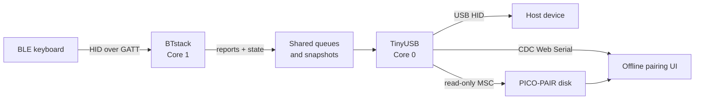
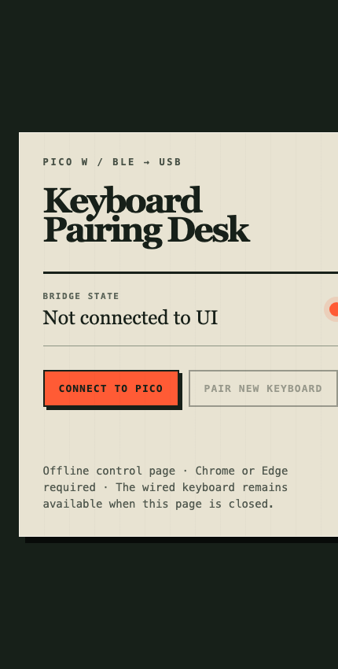

# Bluetooth to USB Keyboard Bridge

[](https://github.com/shahabmokhtari/bluetooth-to-usb-keyboard/actions/workflows/build.yml)
[](https://www.raspberrypi.com/products/raspberry-pi-pico/)
[](#how-it-works)
[](#how-it-works)

Turn a Bluetooth Low Energy keyboard into a portable wired USB keyboard with a
Raspberry Pi Pico W. Pair once with the Pico, then move the Pico between
computers, tablets, KVMs, recovery environments, and other USB hosts without
pairing the keyboard again.

The firmware also exposes a read-only **`PICO-PAIR`** USB drive containing an
offline pairing interface. Open it in Chrome or Edge to view connection status,
display passkeys, and replace the paired keyboard.


## Features

- BLE HID keyboard or mouse input forwarded as standard wired USB HID
- Persistent bonding across Pico and host power cycles
- Offline browser UI stored directly on the Pico
- Pairing-code display over Web Serial
- Confirmed one-click replacement of the active keyboard
- Keyboard-specific HID descriptor pass-through, including media keys
- Stable USB connection across ordinary Bluetooth sleep/reconnect cycles
- Works before operating-system Bluetooth support loads, including many
  firmware setup and recovery environments

## Quick start

### 1. Flash the Pico W

1. Download `picow_ble_usb_hid_bridge_pairing_ui.uf2` from
   [`bin/pico_w`](bin/pico_w).
2. Unplug the Pico W.
3. Hold **BOOTSEL**, reconnect USB, then release **BOOTSEL**.
4. Copy the UF2 file to the `RPI-RP2` drive. The Pico reboots automatically.

### 2. Pair a keyboard

1. Open the new `PICO-PAIR` drive.
2. Open `INDEX.HTM` in **Google Chrome** or **Microsoft Edge**.
3. Click **Connect to Pico** and select `BLE to USB HID Bridge`.
4. Put the keyboard into Bluetooth pairing mode.
5. If the page displays a six-digit code, type it on the Bluetooth keyboard and
   press Enter.

The Pico LED becomes solid when input forwarding is ready.

> Browser security requires a user click before a page can access a serial
> device. The UI is fully offline, but it cannot auto-open or auto-connect.
> Safari and Firefox do not currently implement Web Serial.

### 3. Use it anywhere

Disconnect the Pico from the setup computer and attach it to another USB host.
The target sees a normal wired keyboard. The `PICO-PAIR` drive and browser UI
remain available for diagnostics or replacing the keyboard.

## Pairing a different keyboard

Open the pairing UI, connect to the Pico, and choose **Pair new keyboard**. After
confirmation, the firmware:

1. Disconnects the current keyboard.
2. Deletes its saved BLE bond and active-device record.
3. Scans for the first BLE HID device placed in pairing mode.
4. Displays a new passkey when required.
5. Re-enumerates USB only if the new keyboard uses a different HID descriptor.

This firmware intentionally remembers one active keyboard at a time.

## How it works



Core 1 owns Bluetooth discovery, security, bonding, and HID-over-GATT. Core 0
owns USB HID, CDC, and mass storage. BLE reports cross a spinlock-protected
queue and are sent over a 1 ms USB HID endpoint.

The BLE device's report descriptor is cached and exposed to the USB host
unchanged. Normal BLE reconnects do not disturb USB. A one-time USB
re-enumeration occurs after initial pairing, or when a replacement keyboard has
a different descriptor.

See [Architecture](docs/architecture.md) and
[Pairing UI protocol](docs/pairing-ui.md) for implementation details.

## Building

Required versions:

- Raspberry Pi Pico SDK 2.2.0
- Arm GNU Toolchain 14.2.Rel1
- CMake and Ninja
- Python 3

```bash
export PICO_SDK_PATH=/path/to/pico-sdk
export PICO_TOOLCHAIN_PATH=/path/to/arm-gnu-toolchain

cmake -S src_fw -B build -G Ninja \
  -DPICO_BOARD=pico_w \
  -DCMAKE_BUILD_TYPE=Release
cmake --build build --parallel
```

The resulting firmware is
`build/picow_ble_usb_hid_bridge.uf2`. The build generates the FAT12 pairing
disk from `src_fw/web_ui/index.htm`; no filesystem-generation package is
required.

For the Raspberry Pi Pico VS Code extension workflow, see
[docs/build_vscode.md](docs/build_vscode.md).

## Status LED

| LED | Meaning |
|---|---|
| Off | Wireless initialization has not completed |
| Blinking | Scanning or reconnecting |
| Solid | BLE HID discovery is complete and input is being forwarded |

## Compatibility

The bridge targets BLE HID devices, not Bluetooth Classic-only keyboards.
Verified hardware is tracked in [docs/verified_devices.md](docs/verified_devices.md).
The Microsoft Surface Ergonomic Keyboard has also been validated with
passkey pairing and persistent reconnects.

## Documentation

- [Architecture](docs/architecture.md)
- [Pairing UI and serial protocol](docs/pairing-ui.md)
- [Troubleshooting](docs/troubleshooting.md)
- [Building with VS Code](docs/build_vscode.md)
- [Verified devices](docs/verified_devices.md)
- [Third-party credits](THIRD_PARTY_NOTICES.md)
- [Changelog](CHANGELOG.md)

## License

This project combines code under multiple licenses, including terms inherited
from the original bridge and BlueKitchen BTstack example. Review
[`LICENSE.TXT`](LICENSE.TXT) before redistribution or commercial use. Third-party
projects and their roles are listed in
[`THIRD_PARTY_NOTICES.md`](THIRD_PARTY_NOTICES.md).

<p align="center">
  
</p>
