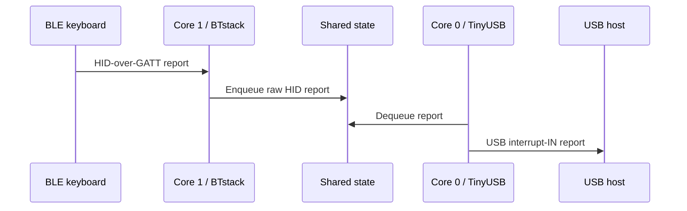

# Architecture

## Data path

The firmware separates Bluetooth and USB work across the RP2040's two cores.

Core 1 exclusively owns BTstack and its state machine. Core 0 exclusively owns
TinyUSB. Cross-core access is limited to fixed-size state and queues protected
by a Pico SDK critical section.

## USB composite device

The Pico exposes three USB functions:

| Function | Purpose |
|---|---|
| HID | Keyboard, mouse, consumer-control, or other reports forwarded from BLE |
| CDC ACM | Newline-delimited control/status protocol used by the browser UI |
| MSC | Read-only FAT12 `PICO-PAIR` volume containing the offline UI |

The FAT12 image is generated at build time by
`tools/generate_msc_image.py` and compiled into flash. MSC writes are rejected
at both the SCSI and FAT attribute layers.

## HID descriptors and USB continuity

The bridge reads the remote HID report descriptor through BTstack and caches it
in a USB-owned buffer. When no keyboard has connected, TinyUSB exposes a generic
placeholder descriptor.

After a keyboard connects:

- If the descriptor is new or differs from the cached descriptor, USB
  disconnects for 100 ms and reconnects so the host reads the correct report
  layout.
- If the descriptor is unchanged, BLE reconnects are invisible to USB and the
  host keeps the same device session.

The whole composite device must re-enumerate when a descriptor changes, so the
pairing disk and Web Serial port briefly disappear when replacing a keyboard
with a different report layout.

## Replacement pairing

`PAIR_NEW` crosses from Core 0 to Core 1 through a spinlock-protected mailbox.
A recurring BTstack timer consumes the request on the Bluetooth core. The
firmware then:

1. Stops pending scan/connect timers.
2. Disconnects the active BLE link if present.
3. Deletes the saved target record and BLE security bond.
4. Clears queued reports from the previous keyboard.
5. Starts unrestricted BLE HID scanning.

Only the first advertising BLE HID device is selected. Users should put only
the intended replacement keyboard into pairing mode.

## Persistent state

BTstack stores security keys in its flash-backed LE device database. The bridge
stores the active device address and address type in a separate TLV record.
Replacement pairing deletes both before scanning. Ordinary power cycles retain
both records and reconnect automatically.
